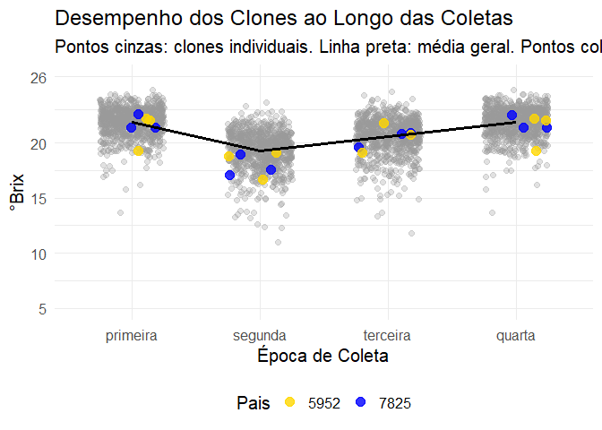

Brix
================
Gabriel Mendes
2025-09-17

# Carregar pacote

``` r
library(tidyverse)
```

    ## ── Attaching core tidyverse packages ──────────────────────── tidyverse 2.0.0 ──
    ## ✔ dplyr     1.1.4     ✔ readr     2.1.5
    ## ✔ forcats   1.0.0     ✔ stringr   1.5.1
    ## ✔ ggplot2   3.5.2     ✔ tibble    3.3.0
    ## ✔ lubridate 1.9.4     ✔ tidyr     1.3.1
    ## ✔ purrr     1.1.0     
    ## ── Conflicts ────────────────────────────────────────── tidyverse_conflicts() ──
    ## ✖ dplyr::filter() masks stats::filter()
    ## ✖ dplyr::lag()    masks stats::lag()
    ## ℹ Use the conflicted package (<http://conflicted.r-lib.org/>) to force all conflicts to become errors

``` r
library(agricolae)
library(readxl)
```

# Carga e Preparação dos Dados

# Separação dos Dados para o Gráfico

``` r
dados_pais <- dados_longos %>%
  filter(clone %in% c("7825", "5952"))

dados_outros_clones <- dados_longos %>%
  filter(!clone %in% c("7825", "5952"))
```

# Geração do Gráfico

``` r
grafico_dispersao <- ggplot(mapping = aes(x = coleta, y = brix)) +
  geom_jitter(
    data = dados_outros_clones,
    width = 0.25,
    alpha = 0.3,
    color = "grey60",
    size = 2
  ) +
  geom_jitter(
    data = dados_pais,
    mapping = aes(color = clone),
    width = 0.25,
    size = 3.5,
    alpha = 0.8
  ) +
  stat_summary(
    data = dados_longos,
    mapping = aes(group = 1),
    fun = "mean",
    geom = "line",
    color = "black",
    linewidth = 1.2
  ) +
  scale_color_manual(
    values = c("7825" = "blue", "5952" = "gold")
  ) +
  scale_y_continuous(
    limits = c(5, 26),
    breaks = c(5, 10, 15, 20, 26)
  ) +
  labs(
    title = "Desempenho dos Clones ao Longo das Coletas",
    subtitle = "Pontos cinzas: clones individuais. Linha preta: média geral. Pontos coloridos: pais.",
    x = "Época de Coleta",
    y = "°Brix",
    color = "Pais"
  ) +
  theme_minimal(base_size = 15) +
  theme(legend.position = "bottom")
```

# Exibir grafico

``` r
print(grafico_dispersao)
```

    ## Warning: Removed 9 rows containing non-finite outside the scale range
    ## (`stat_summary()`).

    ## Warning: Removed 9 rows containing missing values or values outside the scale range
    ## (`geom_point()`).

<!-- -->

# Salvar grafico

``` r
ggsave(
  "grafico_brix_coletas.png",
  plot = grafico_dispersao,
  width = 10,
  height = 7,
  dpi = 300
)
```

    ## Warning: Removed 9 rows containing non-finite outside the scale range
    ## (`stat_summary()`).

    ## Warning: Removed 9 rows containing missing values or values outside the scale range
    ## (`geom_point()`).
